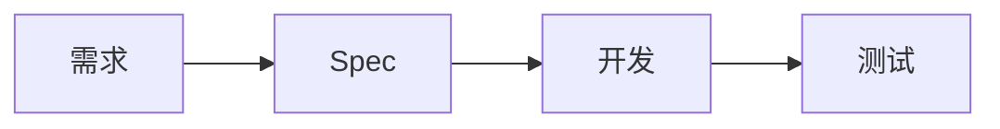
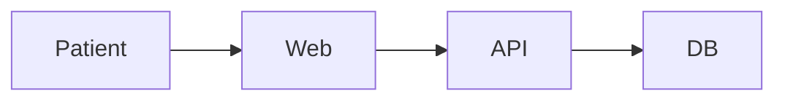

# 00 从 0 开始：学习方法、环境与最小技术基础

> 适合完全没有软件开发经验，或只有 SQL/Linux/实施经验的学习者。本章目标不是“学会写代码”，而是建立后续学习 Spec Engineering 所需的最低技术环境和术语基础。

## 1. 你最终要具备的能力

完成整个仓库后，应能把一句模糊需求：

> “做一个在线预约功能。”

转化为：

```
Business Goal
→ Stakeholders
→ Scope
→ Business Rules
→ Requirements
→ Models
→ API
→ Data
→ Permission
→ NFR
→ Acceptance Criteria
→ Tests
→ Traceability
→ Change Management
```

这就是整个课程的主线。

## 2. 先认识软件系统的基本结构

一个最简单 Web 软件：

```text
用户
 ↓
浏览器
 ↓
前端
 ↓
后端 API
 ↓
数据库
```

### 前端 Frontend

用户直接看到和操作的部分，例如：
- 登录页面
- 搜索框
- 表单
- 列表
- 按钮

### 后端 Backend

负责：
- 业务规则
- 权限
- 数据读写
- API
- 与第三方系统通信

### Database

保存：
- 用户
- 订单
- 预约
- 配置
- 审计等数据

### API

前端和后端、系统和系统之间的“合同”。

例如：

```text
POST /appointments
```

代表创建预约。

后续不要求你先会写 API 代码，但要学会定义它的输入、输出、错误和权限。

## 3. Spec Engineer 需要学到什么技术深度

你暂时不需要：

- 深入算法
- 操作系统内核
- 编译器
- 高级分布式算法
- 大量刷 LeetCode

你需要：

- 能读 HTTP
- 能读 JSON/YAML
- 能读简单 SQL
- 理解表/字段/主外键
- 理解前后端
- 理解 API
- 理解认证和授权
- 理解基本 Git
- 理解日志/错误码
- 能画流程、时序、状态图

目标是：

> 能够准确描述“系统应该怎样工作”，并与 Developer / QA / Architect 沟通。

## 4. 建议安装

### 必须

- Git
- VS Code
- 浏览器
- GitHub 账号

### 推荐

- Postman：学习和测试 API
- DBeaver / SQL Server Management Studio：数据查询
- Swagger Editor：OpenAPI
- draw.io：流程图
- Mermaid：文本图

## 5. VS Code 最低使用

你至少会：

1. 打开文件夹
2. 新建 Markdown
3. 编辑并保存
4. 搜索
5. 使用内置终端
6. 查看 Git change

不需要先学习复杂插件。

## 6. Markdown

Spec 推荐使用 Markdown，因为：
- 纯文本
- Git 可追踪
- diff 清楚
- GitHub 可直接显示

### 标题

```markdown
# 一级标题
## 二级标题
### 三级标题
```

### 列表

```markdown
- Item A
- Item B
```

### 表格

```markdown
| ID | Requirement |
|---|---|
| APPT-001 | 创建预约 |
```

### 代码块

使用三个反引号包住代码。

### Mermaid

GitHub 可直接渲染：



## 7. Git 最低概念

### Repository
项目仓库。

### Commit
一次变更快照。

### Branch
独立工作线。

### Pull Request
提交给团队评审的一组变更。

你现在先知道这些概念，第 12 章详细学习。

## 8. JSON

API 常见：

```json
{
  "id": "A001",
  "status": "BOOKED",
  "patientId": "P001"
}
```

理解：
- key
- value
- string
- number
- boolean
- null
- object
- array

## 9. YAML

OpenAPI 常用：

```yaml
appointment:
  id: A001
  status: BOOKED
```

重点注意缩进。

## 10. SQL 最低预备

至少理解：

```sql
SELECT *
FROM appointment
WHERE status = 'BOOKED';
```

它表示：

> 从 appointment 表中找出状态为 BOOKED 的记录。

数据库章节会继续学习。

## 11. HTTP 最低预备

浏览器和服务器常通过 HTTP 通信。

常见：

- GET：读取
- POST：创建/动作
- PUT/PATCH：修改
- DELETE：删除

响应：

- 200：成功
- 201：创建成功
- 400：请求有问题
- 401：未认证
- 403：无权限
- 404：不存在
- 409：冲突
- 500：服务错误

第 08 章详细学习。

## 12. Authentication / Authorization

必须区分：

### Authentication
你是谁？

例如登录。

### Authorization
你能做什么？

例如 Patient A 不能查看 Patient B 的预约。

这是后续所有商业软件 Spec 的核心。

## 13. 建立贯穿全课程的案例

建议一直使用同一个项目。

本仓库默认：

**医疗预约 SaaS**

角色：
- Patient
- Doctor
- Frontdesk
- Admin

最初功能：
- Login
- Search Doctor
- View Slot
- Book Appointment
- Cancel Appointment

后续每学一章，就在这个项目里增加一个工件。

## 14. 建议的个人目录

```text
my-learning/
  notes/
  exercises/
  project/
    vision.md
    glossary.md
    requirements.md
    models.md
    api.md
    data.md
    nfr.md
    tests.md
```

## 15. 每章的正确学习方式

### Step 1：读正文
先建立中文概念。

### Step 2：看案例
理解怎样从抽象概念变成实际 Spec。

### Step 3：做练习
不要只看。

### Step 4：查原始资料
每章末尾有权威链接。

### Step 5：把结果加入综合项目
形成作品集。

### Step 6：自测
如果不能用自己的话解释，就没有真正掌握。

## 16. 不要陷入工具崇拜

Jira、Confluence、DOORS、Polarion、GitHub 都只是工具。

真正能力是：
- 获取
- 分析
- 建模
- 规格化
- 验证
- 追踪
- 变更

工具会变化，方法更稳定。

## 17. 本章练习

### Exercise 1
创建一个 Markdown：

`my-project.md`

写：
- 项目名称
- 用户
- 5 个功能
- 3 个业务目标

### Exercise 2
建立 5 个 Requirement ID：

```
AUTH-001
DOC-001
SLOT-001
APPT-001
APPT-002
```

### Exercise 3
画：



### Exercise 4
写一个 JSON：

```json
{
  "appointmentId": "A001",
  "status": "BOOKED"
}
```

### Exercise 5
写一个 SQL 查询 BOOKED 预约。

## 18. 自测

1. Frontend / Backend 区别？
2. API 是什么？
3. Database 保存什么？
4. JSON 是什么？
5. Git Commit 是什么？
6. Authentication 和 Authorization 区别？
7. Spec Engineer 为什么需要懂 SQL/API，但不一定要先成为程序员？

## 19. 本章完成标准

如果你可以看懂：

```text
POST /appointments
→ backend
→ transaction
→ appointment table
→ 201 Created
```

大致在说什么，就可以继续。

## 20. 官方资料

1. GitHub Docs 中文  
https://docs.github.com/zh

2. Git 基础  
https://docs.github.com/zh/get-started/using-git/about-git

3. GitHub Mermaid  
https://docs.github.com/zh/get-started/writing-on-github/working-with-advanced-formatting/creating-diagrams

4. MDN HTTP 中文  
https://developer.mozilla.org/zh-CN/docs/Web/HTTP

5. Microsoft Learn：开发人员学习路径  
https://learn.microsoft.com/zh-cn/training/career-paths/developer

6. Microsoft Learn：关系数据概念  
https://learn.microsoft.com/en-us/training/modules/describe-concepts-of-relational-data/
