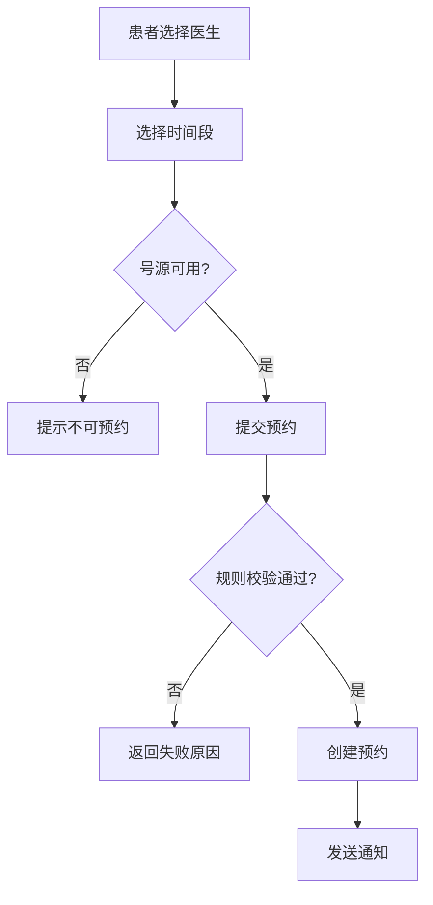
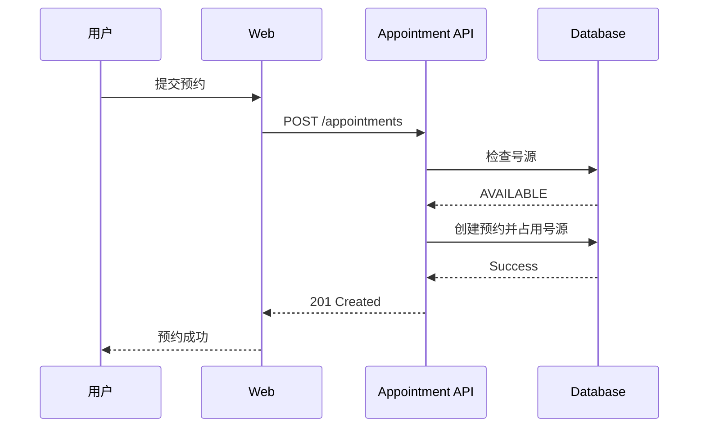
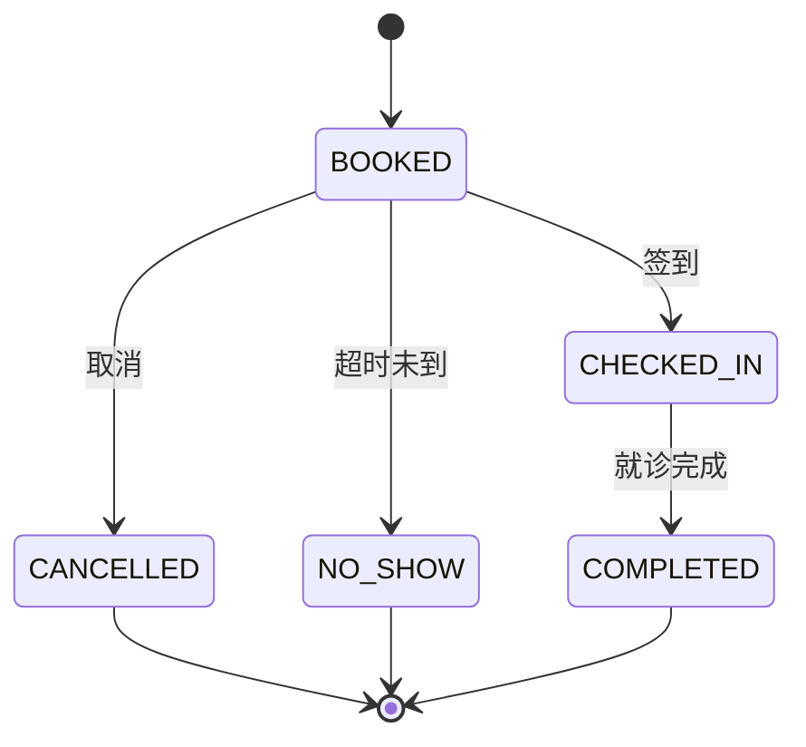

# 04 需求建模：UML / BPMN / Mermaid

## 本章目标

学完后应能判断：

- 什么时候用流程图
- 什么时候用用例图
- 什么时候用时序图
- 什么时候用状态机
- 什么时候用数据/类模型

建模不是为了“画得专业”，而是为了发现自然语言不容易暴露的问题。

## 一、先学会选择图

| 想表达什么 | 推荐模型 |
|---|---|
| 业务流程 | BPMN / Activity Diagram |
| 谁使用哪些功能 | Use Case Diagram |
| 系统交互顺序 | Sequence Diagram |
| 一个对象有哪些状态 | State Diagram |
| 数据对象关系 | ER / Class Diagram |
| 系统边界和组件 | C4 / Component Diagram |

## 二、流程图 / Activity Diagram

适合回答：

“业务从哪里开始，经过什么判断，到哪里结束？”

预约示例：

画完后应检查：

- 有没有遗漏分支？
- 有没有永远到不了的节点？
- 失败后回到哪里？
- 人工步骤和系统步骤是否区分？

## 三、Use Case

Use Case 关注“参与者为了达到目标与系统发生什么交互”。

一个完整用例说明建议包含：

- Use Case ID
- Name
- Actor
- Goal
- Trigger
- Preconditions
- Main Flow
- Alternative Flow
- Exception Flow
- Postconditions
- Business Rules
- Related Requirements

### 示例

**UC-APPT-01 创建预约**

Actor：患者

Precondition：
- 患者已登录
- 患者档案有效

Main Flow：
1. 患者选择医生。
2. 系统显示可预约日期。
3. 患者选择时间段。
4. 系统验证号源。
5. 患者确认。
6. 系统创建预约。
7. 系统显示预约成功。

Alternative：
- A1：号源已被其他人占用 → 系统提示重新选择。

## 四、Sequence Diagram

适合接口和系统交互。

时序图很容易发现：

- 谁负责校验？
- 谁修改状态？
- 是否存在并发问题？
- 第三方失败会怎样？

## 五、State Diagram

当业务对象存在生命周期时非常重要。

预约状态可能：

必须继续定义：

- 谁能触发每个转换？
- 转换条件是什么？
- 是否可逆？
- 失败怎么办？
- 是否记录转换历史？

## 六、BPMN

BPMN 是 OMG 的业务流程建模标准，适合：

- 多角色流程
- 跨部门业务
- 消息事件
- 定时事件
- 并行流程

初学者无需一次掌握全部符号，先理解：

- Event
- Task
- Gateway
- Sequence Flow
- Pool / Lane
- Message Flow

## 七、Mermaid 的价值

GitHub 可以直接渲染 Mermaid，因此 Spec 可同时拥有：

- 文本可审查
- Git 可追踪差异
- 图形自动渲染

对于工程团队，比截图更容易维护。

## 八、练习

请对“取消预约”至少画：

1. Activity / Flowchart
2. Sequence Diagram
3. Appointment State Diagram

然后回答：

- 取消后号源何时释放？
- 已签到能否取消？
- 医生取消和患者取消是否相同？
- 是否有取消截止时间？

## 官方资料

- OMG UML：<https://www.omg.org/spec/UML/>
- OMG BPMN：<https://www.omg.org/spec/BPMN/>
- Mermaid 官方：<https://mermaid.js.org/>
- GitHub Mermaid：<https://docs.github.com/zh/get-started/writing-on-github/working-with-advanced-formatting/creating-diagrams>
