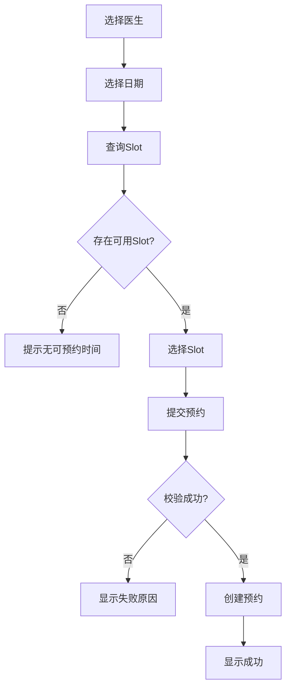
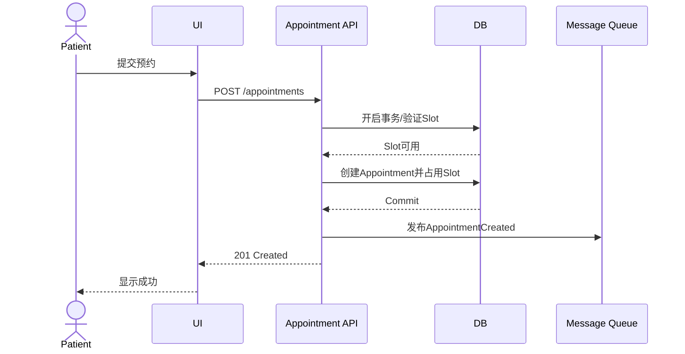
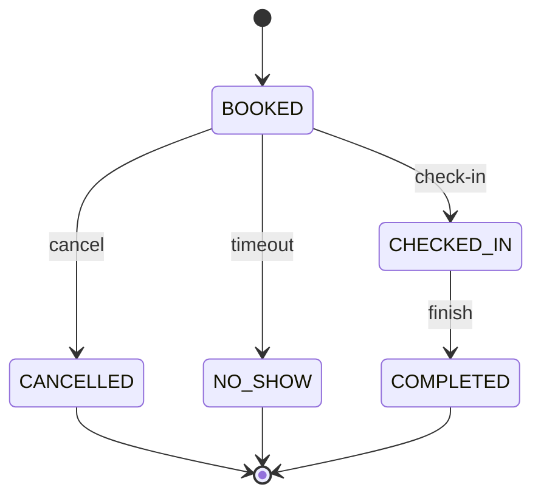
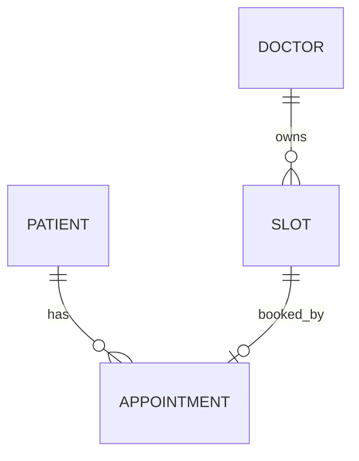
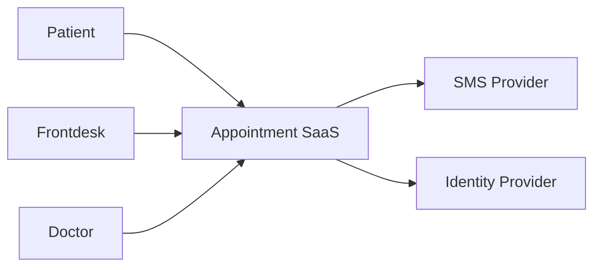

# 04 需求建模：Flow、UML、BPMN、状态机与时序图

> 本章目标：不是“学会画图”，而是学会选择正确模型，把自然语言中隐藏的分支、状态、责任和交互暴露出来。

---

# 1. 为什么要建模

自然语言很适合描述，但不擅长同时表达：

- 多角色
- 多分支
- 并行
- 状态
- 顺序
- 依赖
- 数据关系

模型的价值是：

> 用不同视角检查同一需求。

---

# 2. 模型选择表

| 想回答 | 模型 |
|---|---|
| 业务从开始到结束怎样流转 | Flowchart / BPMN |
| 谁使用系统完成什么目标 | Use Case |
| 系统之间按什么顺序交互 | Sequence Diagram |
| 一个对象有哪些生命周期状态 | State Machine |
| 数据实体如何关联 | ER / Class Diagram |
| 系统与外部系统边界 | System Context / C4 |

---

# 3. Flowchart

预约流程：



检查：
- 所有 Decision 都有完整分支吗？
- 失败后去哪？
- 是否存在循环？
- 是否有人工步骤？
- 是否有第三方？

---

# 4. BPMN 基础

BPMN 是 OMG 维护的业务流程建模标准。

初学阶段掌握：

- Event：事件
- Task：任务
- Gateway：分支/汇合
- Sequence Flow：同一流程顺序
- Pool：参与组织
- Lane：角色
- Message Flow：参与者之间消息

BPMN 更适合：
- 跨部门
- 审批
- 消息交互
- 定时触发
- 并行处理

例如“请假审批”通常比简单 Flowchart 更适合 BPMN。

官方标准：
https://www.omg.org/spec/BPMN/

---

# 5. Use Case

Use Case 关注：

> Actor 为达到一个 Goal，与系统如何交互？

不要把 Use Case 画成“功能菜单”。

一个完整 Use Case 应包含：

```
ID
Name
Actor
Goal
Trigger
Preconditions
Main Flow
Alternative Flow
Exception Flow
Postconditions
Business Rules
Related Requirements
```

---

# 6. Use Case 示例

## UC-APPT-01 创建预约

**Actor**：Patient

**Goal**：为自己创建医生预约。

**Preconditions**
- 已认证
- Patient 账号有效

**Trigger**
- Patient 选择一个 AVAILABLE Slot 并提交。

**Main Flow**
1. 系统接收请求。
2. 验证 Patient 权限。
3. 验证 Slot 存在。
4. 验证 Slot 可用。
5. 创建 Appointment。
6. 占用 Slot。
7. 写审计事件。
8. 返回创建成功。

**Alternative Flow**
- A1 Slot 已占用 → 返回冲突。
- A2 Slot 不存在 → 返回 Not Found。
- A3 Patient 越权 → 返回 Forbidden。

**Postcondition**
- 存在 BOOKED Appointment。
- Slot 不再可预约。

---

# 7. Sequence Diagram

关注：

> 谁先调用谁？



通过图可以追问：
- MQ 失败会回滚 Appointment 吗？
- DB Commit 后 API 超时怎么办？
- 用户重试会重复创建吗？

这就是模型的价值。

---

# 8. State Machine

当对象具有生命周期时，状态模型极其重要。

Appointment：



还要写转换表：

| From | Event | To | Actor | Guard |
|---|---|---|---|---|
| BOOKED | cancel | CANCELLED | Patient | >=2h |
| BOOKED | check-in | CHECKED_IN | Frontdesk | allowed window |
| BOOKED | timeout | NO_SHOW | System | timeout |
| CHECKED_IN | complete | COMPLETED | Staff | visit complete |

任何图外转换默认禁止，或者明确指出策略。

---

# 9. Guard Condition

状态转换不是只有 From/To。

例如：

```
BOOKED --cancel [startAt-now >= 2h]--> CANCELLED
```

这个 `>=2h` 是 Guard。

Spec 中必须变成可测试条件。

---

# 10. ER / Data Model



模型帮助发现：
- 一个 Appointment 是否可以多个 Slot？
- Slot 能否没有 Appointment？
- 一个 Patient 能有多个 Appointment？

---

# 11. Context Diagram

先画系统边界：



每个箭头继续问：
- 什么数据？
- 谁发起？
- 协议？
- 安全？
- 失败怎么办？

---

# 12. 模型与 Requirement 的双向验证

不要画完图就结束。

例：

State Diagram 有：
`BOOKED → CANCELLED`

检查：
- 哪条 Requirement 定义？
- 哪个 API 实现？
- 哪个 Test Case 验证？

反过来：
Requirement 有 “NO_SHOW”
- State Diagram 是否有？
- 哪个事件触发？

---

# 13. 常见错误

## 图和文字冲突
图说 2 小时，Requirement 写 1 小时。

解决：
- 定义 Source of Truth
- Review 时交叉检查

## 图只画 Happy Path
必须有 failure / alternative。

## 状态过多
状态应代表业务生命周期，不要把页面状态都放进去。

## Sequence Diagram 过度实现
需求阶段重点是责任和契约，不必提前描述所有类和方法。

---

# 14. Mermaid

GitHub 原生支持 Mermaid，适合：
- Flow
- Sequence
- State
- ER

优点：
- 文本版本控制
- PR 可 review
- 复制方便
- 自动渲染

官方：
https://docs.github.com/zh/get-started/writing-on-github/working-with-advanced-formatting/creating-diagrams

---

# 15. 本章练习

对“取消预约”完成：

### Flow
从患者点击取消到完成/失败。

### Use Case
写 Main / Alternative / Exception。

### Sequence
至少包含 UI、API、DB、Notification。

### State
覆盖 BOOKED/CANCELLED/CHECKED_IN/COMPLETED。

### ER
Appointment 与 Slot、Patient 的关系。

然后写：
- 5 个从模型中发现的新问题
- 5 条因为模型而新增/修改的 Requirement

---

# 16. 自测

1. Flowchart 和 State Diagram 的核心区别？
2. Sequence Diagram 主要揭示什么问题？
3. 为什么 Use Case 不能只画椭圆？
4. Guard Condition 是什么？
5. BPMN 适合什么场景？
6. 图和 Spec 冲突时怎么办？
7. 为什么模型必须关联 Requirement/Test？

---

# 17. 权威原始资料

1. OMG UML Specification  
https://www.omg.org/spec/UML/

2. OMG BPMN Specification  
https://www.omg.org/spec/BPMN/

3. Mermaid 官方文档  
https://mermaid.js.org/

4. GitHub Mermaid 中文文档  
https://docs.github.com/zh/get-started/writing-on-github/working-with-advanced-formatting/creating-diagrams

5. IREB CPRE Foundation  
https://cpre.ireb.org/en/concept/foundationlevel
