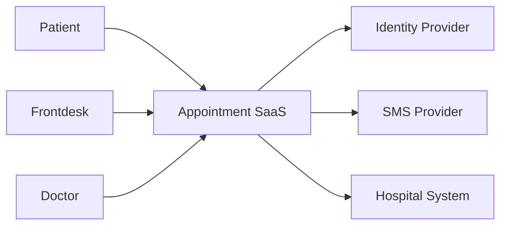

# 07 系统设计与架构基础：Spec Engineer 必须理解的技术结构

> 本章目标：不是把你训练成架构师，而是让你能够读懂系统结构、识别关键技术约束，并把对业务有影响的架构条件写进 Spec。

## 1. 为什么 Spec Engineer 必须懂架构

如果你完全不理解系统结构，很难回答：

- 一个需求会影响哪些模块？
- 数据在哪里保存？
- 哪个系统拥有最终事实？
- 哪个 API 是同步还是异步？
- 第三方失败会不会影响主流程？
- 并发时如何保证业务不变量？
- 性能目标是否现实？

Spec Engineer 不需要决定所有实现细节，但必须理解实现约束并能与 Architect / Developer 沟通。

## 2. 最基础的系统组成

典型 SaaS：

```text
Browser / Mobile
      ↓
Frontend
      ↓
Backend API
      ↓
Database
```

更完整的系统还可能有：

- API Gateway
- Cache
- Message Queue
- Object Storage
- Search Engine
- Identity Provider
- Monitoring / Logging
- External SaaS

## 3. System Boundary

写 Spec 前先确定：

> 什么属于本系统，什么属于外部系统？

医疗预约示例：

本系统：
- 预约业务页面
- Appointment API
- Slot 管理
- Audit

外部：
- SMS Provider
- Identity Provider
- HIS/EMR
- Email Provider

边界错误会直接导致 Scope 混乱。

## 4. System Context



每一个外部依赖都应该继续回答：

- 谁调用谁？
- 什么数据？
- 协议？
- Auth？
- Timeout？
- Retry？
- Failure behavior？
- SLA？
- Ownership？

## 5. C4 Model 思维

C4 常分为：

1. System Context
2. Container
3. Component
4. Code

Spec Engineer 最常使用前两层。

Container 示例：

- Web App
- Appointment API
- Auth Service
- SQL Database
- Message Queue
- Notification Worker

意义是让团队快速理解系统主要运行单元。

## 6. 同步 vs 异步

### 同步

```text
Client → API → DB → Response
```

用户等待结果。

适合：
- 登录
- 查询
- 创建预约

### 异步

```text
API → Queue → Worker → SMS Provider
```

主请求不必等待完整处理。

适合：
- 短信
- 邮件
- 报表
- 大批量任务

## 7. 异步 Spec 必须明确什么

不要只写：

> “发送短信使用消息队列。”

还应定义：

- 什么时候视为业务成功？
- 消息什么时候入队？
- Worker 失败是否重试？
- 重试多少次？
- 重复消费是否安全？
- 最终失败去哪里？
- 是否可人工重放？
- 是否告警？

## 8. Retry

Microsoft Azure Architecture Center 提供 Retry Pattern。

核心思想：

> 短暂故障可以重试，但不是所有错误都应该重试。

适合重试：
- transient network failure
- temporary service unavailable

不应盲目重试：
- 400 invalid request
- 403 forbidden
- 业务状态冲突

Spec 需要定义“业务预期”，具体算法由架构决定。

## 9. Circuit Breaker

当下游持续失败时，如果一直重试可能拖垮整个系统。

Circuit Breaker 思路：

```text
正常调用
→ 连续失败达到阈值
→ 暂停调用
→ 等待恢复
→ 试探恢复
```

Spec Engineer 不一定定义技术参数，但涉及 SLA/降级时要理解该机制。

## 10. Transaction

事务核心：

> 一组操作要么作为整体成功，要么保持一致失败。

预约创建：

1. 确认 Slot 可用
2. 创建 Appointment
3. 占用 Slot

如果只完成第 2 步，数据可能错误。

因此可以定义业务不变量：

> 不能出现一个 Slot 被两个有效 Appointment 占用。

Spec 应写“不变量和可观察结果”，而不是越权设计锁实现。

## 11. 并发

错误思路：

```text
1. 查询 Slot = AVAILABLE
2. 如果可用，创建 Appointment
```

两个请求可能同时执行第 1 步。

因此 Requirement：

> 当多个请求并发预约同一 Slot 时，系统必须确保最多一个请求成功。

这就是从业务规则推导技术约束。

## 12. Strong Consistency vs Eventual Consistency

### Strong
写完后立刻看到一致结果。

### Eventual
允许短时间不同步，最终一致。

例如：
- Appointment 主状态通常需要更强一致性
- Analytics 报表可能允许几分钟延迟

Spec 要明确业务允许的数据延迟。

## 13. Cache

Cache 常用于：
- 高频读取
- 降低 DB 压力

但会引入：
- stale data
- invalidation
- consistency

例如医生列表缓存 5 分钟可能可接受；预约 Slot 状态缓存 5 分钟可能造成冲突。

因此“数据新鲜度”本身也是需求。

## 14. Message Queue

Queue 的价值：
- 解耦
- 削峰
- 异步
- 重试

但会带来：
- duplicate
- ordering
- poison message
- retry
- dead-letter queue

所以事件消费者常需要幂等。

## 15. Idempotency

幂等指：

> 同一业务操作重复请求，不应产生额外副作用。

例如用户第一次预约成功，但响应丢失，于是再次提交。

系统不能因此产生两个有效 Appointment。

可以通过：
- Idempotency Key
- Unique Business Key
- Request Deduplication

实现。

Spec 应定义业务结果，而不是强制某种实现。

## 16. Dependency Spec

每个外部服务建议记录：

| 项目 | 示例 |
|---|---|
| System | SMS Provider |
| Purpose | 发送提醒 |
| Direction | SaaS → SMS |
| Protocol | HTTPS |
| Auth | API credential |
| Timeout | TBD |
| Retry | TBD |
| Failure Impact | 不回滚已创建预约 |
| Monitoring | failure metric |
| Owner | Notification Team |

## 17. Failure Mode

对每个依赖问：

- unavailable
- slow
- invalid response
- partial response
- duplicate response
- timeout
- authentication failure

然后定义系统行为。

## 18. Architecture Decision Record

重要长期决策应记录 ADR。

示例：

```markdown
# ADR-003 通知发送采用异步队列

状态：Accepted

原因：
第三方短信服务不应增加预约创建延迟。

决定：
预约创建成功后发布通知事件，由后台 Worker 发送短信。

影响：
预约成功不代表短信已发送成功。
必须增加重试、失败记录与监控。
```

## 19. Spec Engineer 要避免越权

不要在没有依据时写：

- 必须使用 Kafka
- 必须使用 Redis
- 必须拆微服务

除非：
- 项目标准明确
- Architecture Decision 已批准
- 客户有硬约束

更好的写法：

> 通知处理不得阻塞预约主交易超过业务允许阈值。

然后由架构团队设计技术方案。

## 20. 本章练习

针对医疗预约：

1. 画 Context Diagram。
2. 画 Container Diagram。
3. 列出 5 个外部依赖。
4. 每个依赖写 3 个 Failure Mode。
5. 写 3 条并发 Requirement。
6. 写 2 条 Idempotency Requirement。
7. 写 2 个 ADR。

## 21. 自测

1. System Boundary 为什么重要？
2. 同步和异步的区别？
3. 为什么 Retry 不能无限做？
4. 什么是业务不变量？
5. Eventual Consistency 什么时候可以接受？
6. Cache 为什么可能影响业务正确性？
7. 幂等解决什么问题？
8. Spec Engineer 为什么不能随意指定技术栈？

## 22. 权威原始资料

1. Microsoft Azure Architecture Center  
https://learn.microsoft.com/zh-cn/azure/architecture/

2. Azure Architecture Patterns  
https://learn.microsoft.com/zh-cn/azure/architecture/patterns/

3. Retry Pattern  
https://learn.microsoft.com/zh-cn/azure/architecture/patterns/retry

4. Circuit Breaker Pattern  
https://learn.microsoft.com/zh-cn/azure/architecture/patterns/circuit-breaker

5. Queue-Based Load Leveling  
https://learn.microsoft.com/zh-cn/azure/architecture/patterns/queue-based-load-leveling

6. Architecture Design Specification  
https://learn.microsoft.com/en-us/azure/well-architected/architect-role/architecture-design-specification

7. C4 Model  
https://c4model.com/
