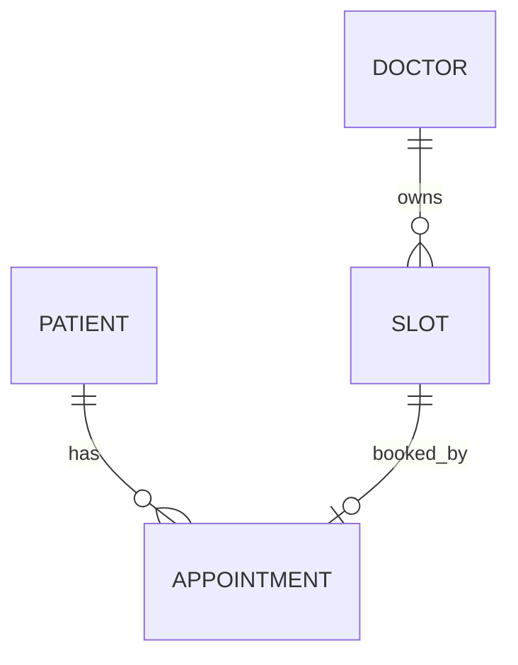

# 09 数据库与数据规格：Spec Engineer 必须掌握的数据基础

> 本章目标：能够从业务对象抽象数据实体，编写 Data Dictionary，理解关系、约束、事务、生命周期、敏感数据和 SQL 基础。

## 1. 为什么 Spec Engineer 要懂数据

很多需求最终都会变成数据变化。

例如：

> “取消预约。”

真正的数据问题：

- Appointment.status 变成什么？
- cancelled_at 是否记录？
- Slot.status 是否变化？
- 原状态是否保留？
- Audit 是否记录？
- 是否物理删除？
- 报表如何处理？

如果不了解数据，很容易写出只有 UI、没有系统行为的 Spec。

## 2. 关系数据库基本概念

### Table
实体集合。

### Row
一条记录。

### Column
字段。

### Primary Key
唯一识别一行。

### Foreign Key
关联其他实体。

### Unique Constraint
保证唯一性。

### Index
提升特定查询效率。

### Transaction
确保一组操作在一致性边界内完成。

## 3. Entity

预约系统可以有：
- User
- Patient
- Doctor
- Schedule
- Slot
- Appointment
- AuditLog

不要从页面名称出发设计数据，而应从业务对象出发。

## 4. ER Model



模型帮助我们问：
- 一个 Patient 有几个 Appointment？
- 一个 Slot 能否无 Appointment？
- 一个 Slot 是否最多一个 Appointment？
- “有效 Appointment”的定义是什么？

## 5. Data Dictionary

| Field | Type | Null | Default | Meaning | Rule |
|---|---|---:|---|---|---|
| id | UUID | No | - | 内部ID | PK |
| patient_id | UUID | No | - | Patient | FK |
| slot_id | UUID | No | - | Slot | FK |
| status | varchar | No | BOOKED | 状态 | enum |
| created_at | datetime | No | now | 创建时间 | UTC |
| cancelled_at | datetime | Yes | null | 取消时间 | cancelled only |

## 6. NULL

NULL 不等于：
- 空字符串
- 0
- false

每个字段要问：
- 是否可空？
- 空代表什么？
- 默认值？
- 是否必须显式传？

例如：

`cancelled_at = NULL`

可以表示“从未取消”。

## 7. Internal ID 与 Business ID

数据库内部主键不一定等于用户看到的编号。

例如：

```text
id = UUID
appointmentNo = AP202609250001
```

Spec 要区分两者用途。

## 8. Relationship

### One-to-One
一个对象对应一个对象。

### One-to-Many
一个 Patient 多个 Appointment。

### Many-to-Many
例如医生与科室可能多对多。

多对多通常需要关联实体。

## 9. Unique Constraint

例：

> Email 必须唯一。

但还要问：
- 是否区分大小写？
- 删除后是否可复用？
- 多租户下是全局唯一还是 tenant 内唯一？

“唯一”也是业务规则。

## 10. Business Invariant

业务要求：

> 同一个 Slot 不能有两个有效 Appointment。

你需要明确这个不变量。

实现可能使用：
- unique constraint
- lock
- transaction
- status-aware schema

由架构/开发决定。

## 11. Transaction

预约创建：

```text
Check Slot
Create Appointment
Update Slot
Commit
```

失败时不能留下：
- Appointment 已成功
- Slot 仍 AVAILABLE

可以写 Requirement：

> 创建预约失败时，不得产生部分可见的业务结果。

## 12. Data Lifecycle

每个重要实体都要问：

```text
Create
Read
Update
Archive
Delete
Restore
Retain
Purge
```

## 13. Soft Delete

Soft Delete 可能使用：
- deleted_at
- is_deleted
- status=INACTIVE

优点：
- 可恢复
- 保留历史

代价：
- 查询复杂
- 唯一约束复杂
- 数据增长

不要默认所有实体都 Soft Delete。

## 14. Audit 与业务表不同

Audit 通常要记录：
- actor
- action
- object
- timestamp
- old value
- new value
- result
- correlation id

Debug log 不能自动等于 Audit log。

## 15. Sensitive Data

识别：
- PII
- credentials
- medical data
- financial data
- tokens

Spec 中考虑：
- who can access
- masking
- encryption
- retention
- logging
- export

## 16. Data Ownership

集成环境中必须问：

> 哪个系统是这个数据的 System of Record？

例如：
- Patient demographics 可能来自 HIS
- Appointment 可能由 SaaS 自己拥有

Ownership 不明确会导致双向覆盖冲突。

## 17. Data Synchronization

外部同步要定义：
- direction
- frequency
- conflict policy
- retry
- duplicate
- late arrival
- missing data

## 18. SQL 最低能力

### SELECT

```sql
SELECT id, status
FROM appointment;
```

### WHERE

```sql
SELECT *
FROM appointment
WHERE status = 'BOOKED';
```

### JOIN

```sql
SELECT a.id, p.display_name
FROM appointment a
JOIN patient p ON p.id = a.patient_id;
```

### GROUP BY

```sql
SELECT status, COUNT(*)
FROM appointment
GROUP BY status;
```

Spec Engineer 可以用 SQL：
- 验证业务理解
- 分析旧数据
- 检查边界
- 支持验收

## 19. Index 基础

Index 可以提高查询性能，但会增加：
- storage
- write cost

Spec 一般不直接指定索引，除非已经有明确架构设计。

你只需理解：
- WHERE/JOIN 常受索引影响
- 大表无合适索引可能很慢

## 20. Data Migration

新增字段：

```text
appointment.cancel_reason
```

要问：
- old rows 怎么办？
- nullable？
- default？
- backfill？
- rollback？
- API compatibility？

这也是 Spec 设计的一部分。

## 21. Data Spec Checklist

### Entity
- 意义？
- Owner？

### Field
- type
- required
- default
- range
- enum

### Relation
- cardinality
- FK

### Lifecycle
- delete
- archive
- retention

### Security
- sensitivity
- access

### Migration
- backward compatibility

## 22. 练习

设计“企业请假系统”：

实体：
- Employee
- LeaveRequest
- LeaveType
- LeaveBalance
- Approval

要求：
- ER 图
- 每表 5+ 字段
- PK/FK
- Enum
- Null
- Data lifecycle
- 3 个业务不变量

然后写 5 条 SQL 查询。

## 23. 自测

1. NULL 和空字符串区别？
2. PK 和 Business ID 区别？
3. Unique 和业务规则什么关系？
4. 什么是 Data Ownership？
5. 为什么 Soft Delete 不是免费方案？
6. Migration 为什么属于 Spec 风险？
7. Transaction 解决什么？
8. Audit Log 与 Debug Log 区别？

## 24. 权威原始资料

1. Microsoft Learn：关系数据概念  
https://learn.microsoft.com/en-us/training/modules/describe-concepts-of-relational-data/

2. Microsoft SQL 文档  
https://learn.microsoft.com/zh-cn/sql/

3. Azure Data Architecture Guide  
https://learn.microsoft.com/zh-cn/azure/architecture/data-guide/

4. Azure 数据存储选择  
https://learn.microsoft.com/zh-cn/azure/architecture/guide/technology-choices/data-store-overview
