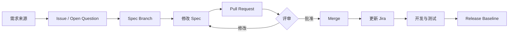

# 12 工程协作：Git、GitHub、Jira、Confluence 与需求变更

> 本章目标：掌握 Spec Engineer 在真实研发团队中的文档协作、版本控制、评审、基线、变更与任务追踪方法。即使公司使用的不是 GitHub/Jira/Confluence，你也应该能迁移这些方法。

---

## 1. 为什么 Spec 也要版本控制

规格说明不是“一次写完的 Word 文档”，而是会持续变化的工程资产。你必须能回答：

- 当前开发依据的是哪一版 Spec？
- 某条需求是谁、什么时候、为什么修改的？
- 修改前是什么？
- 哪些开发任务和测试用例受影响？
- 哪个版本已经评审通过？
- 发布版本使用了哪组需求？

Git 的核心价值就是保存“变更历史”。GitHub 官方将版本控制描述为：跟踪个人和团队协作时的变更历史，使团队能够看到改了什么、谁改的、何时改的以及为什么改。

对于 Spec Engineer 来说，这意味着 Markdown 文档、OpenAPI、Mermaid、SQL、测试数据等都可以和代码一样版本化。

---

## 2. Git 必须理解的概念

### 2.1 Repository（仓库）

一个仓库保存：
- 当前文件
- 历史版本
- 分支
- 提交记录
- 作者与时间

### 2.2 Commit（提交）

Commit 是一次可追踪的变更快照。

差的提交：

```
update
修改
fix
```

好的提交：

```
docs: clarify appointment cancellation window
spec: add APPT-409 conflict response
docs: add traceability matrix for appointment module
```

一个 Commit 最好表达一个逻辑变化。

### 2.3 Branch（分支）

不要直接在正式版本上随意修改。

示例：

```
main
 ├─ spec/appointment-cancellation
 ├─ spec/permission-model
 └─ fix/api-error-codes
```

分支的价值：
- 隔离未完成工作
- 允许多人并行
- 方便评审
- 不污染基线

### 2.4 Pull Request（PR）

PR 是“把一组变更提交给团队评审”。

GitHub 官方说明，Pull Request 会把更改转换成一个可以讨论和审查的协作空间，在合并前让团队查看差异、评论和自动检查。

Spec 文档同样适用。

一个需求变更 PR 建议写：

```markdown
## 变更原因
患者取消规则由“预约前1小时”改为“预约前2小时”。

## 受影响需求
- APPT-CAN-001
- APPT-CAN-006

## 受影响接口
- POST /appointments/{id}/cancel

## 受影响测试
- TC-CAN-001
- TC-CAN-002
- TC-CAN-005

## 风险
已有移动端可能仍显示旧规则。

## 待评审人
Product / Backend / QA
```

---

## 3. 最低 Git 操作

第一次：

```bash
git clone <repository-url>
cd spec-learning
```

创建分支：

```bash
git checkout -b spec/appointment
```

查看变化：

```bash
git status
git diff
```

提交：

```bash
git add .
git commit -m "spec: define appointment cancellation rules"
```

推送：

```bash
git push -u origin spec/appointment
```

然后在 GitHub 创建 Pull Request。

### 你不需要一开始学习复杂 Git

Spec Engineer 第一阶段会以下内容即可：

- clone
- status
- diff
- add
- commit
- pull
- push
- checkout/switch
- branch
- 基本冲突处理

---

## 4. Spec Review 应该评什么

不要把评审变成语法检查。

### Product / BA 关注
- 是否解决真实业务问题？
- 业务规则是否正确？
- Scope 是否合理？

### Developer 关注
- 是否存在歧义？
- 是否可实现？
- 接口和数据是否一致？
- 并发、事务、异常是否遗漏？

### QA 关注
- 是否可测试？
- 验收标准是否明确？
- 边界条件是否定义？
- 状态转换是否完整？

### Security / Architecture 关注
- 权限
- 敏感数据
- 可用性
- 性能
- 外部依赖
- 技术约束

---

## 5. Jira 的真正作用

不要把 Jira 理解为“填工单的软件”。

它主要帮助团队把工作组织成：

```
Epic
  ├─ Story
  │   ├─ Task
  │   └─ Test / Bug
  └─ Story
```

一个 Story 至少应关联：
- Spec/PRD
- Acceptance Criteria
- 设计
- API
- 测试
- 缺陷

### 示例

Epic：
`EPIC-20 在线预约`

Story：
`APPT-101 患者创建预约`

Acceptance Criteria：
- 有效号源可以创建
- 已占用号源返回冲突
- 重复提交不会产生两个有效预约
- 无权限不能代其他患者创建

Developer Task：
- Backend API
- DB migration
- Frontend page

QA：
- TC-101 ~ TC-110

---

## 6. Confluence / Wiki 的适用场景

适合保存：
- Product Requirement
- 项目背景
- 术语
- 决策记录
- 会议结果
- 架构说明
- 长期维护的知识

不适合把所有细颗粒度执行任务都塞进一个大页面。

Atlassian 的产品需求模板建议记录：
- 项目/功能基本信息
- 目标
- 成功指标
- 假设
- User Story
- UX/设计
- Scope

---

## 7. Single Source of Truth

团队最危险的问题之一：

- Confluence 一版
- Word 一版
- 群聊一版
- Jira 又一版
- Developer 本地还有一版

必须定义“哪个地方是正式事实来源”。

示例：

| 内容 | Source of Truth |
|---|---|
| 业务目标 | Confluence PRD |
| 功能 Spec | Git repository |
| API contract | OpenAPI |
| 执行任务 | Jira |
| Test case | Test Management |
| 架构决策 | ADR |

其他地方只能引用，不要复制出多个独立版本。

---

## 8. Baseline（需求基线）

IREB 将 Baseline 定义为稳定、受变更控制的一组工作产品配置。

工程化理解：

> “这一版已经正式批准，开发和测试按它工作；之后任何变化都必须显式变更。”

可以通过：
- Git tag
- Release branch
- 文档版本
- DOORS/Polarion baseline

实现。

例如：

```
spec-v1.0.0
spec-v1.1.0
```

---

## 9. Change Request（CR）完整流程

不要直接改需求。

建议流程：

```
提出变更
   ↓
记录原因
   ↓
影响分析
   ↓
估算成本/风险
   ↓
评审与批准
   ↓
更新 Spec
   ↓
更新追踪关系
   ↓
更新开发与测试
   ↓
形成新基线
```

### Change Request 模板

```markdown
# CR-2026-015

## 原因
业务要求允许医生主动取消预约。

## 当前行为
仅患者和管理员可以取消。

## 目标行为
医生可以取消自己的未来预约。

## 影响
- 权限矩阵
- Appointment State Machine
- Cancel API
- Notification
- Audit Log
- UI
- Test Cases

## 风险
医生误操作可能大规模取消预约。

## 待决定
是否需要二次确认？
是否要求填写取消原因？
是否批量通知患者？
```

---

## 10. Decision Log / ADR

项目中的重要决定必须留下原因。

例：

```markdown
# ADR-007 预约删除采用逻辑删除

状态：Accepted

背景：
预约是审计相关业务数据，物理删除会破坏历史记录。

决定：
取消预约只更新 status=CANCELLED，不物理删除。

影响：
所有查询默认排除/区分 CANCELLED。
数据库保留完整历史。
```

这样几个月后团队不会重新讨论“为什么这样做”。

---

## 11. 一套推荐工作流



---

## 12. 本章实操

在自己的项目仓库中完成：

1. 建立 `spec/appointment-cancellation` 分支。
2. 修改取消预约 Spec。
3. 提交至少两个 commit。
4. 创建 PR。
5. PR 描述中写影响分析。
6. 自己模拟 Product / Dev / QA 各写一条 review comment。
7. 合并后创建 `spec-v1.0` tag（如果你熟悉 Git）。
8. 新建一份 Decision Log。

---

## 13. 自测

1. 为什么不能把聊天记录当作正式需求基线？
2. Commit 与 PR 的区别是什么？
3. 为什么 Spec 文档也适合 Git？
4. Baseline 的意义是什么？
5. 一个 Change Request 最重要的内容有哪些？
6. Jira Story 和 SRS Requirement 是否一定一一对应？
7. 什么是 Single Source of Truth？
8. 为什么一个需求变更必须同步检查测试？

---

## 14. 本章完成标准

你能够：
- 使用 Git 管理 Spec 文档；
- 创建需求变更 PR；
- 进行结构化 Spec Review；
- 建立 Baseline；
- 完成 Change Impact Analysis；
- 将需求、任务、测试关联起来。

---

## 权威原始资料

1. GitHub 中文文档：使用 Git  
   https://docs.github.com/zh/get-started/using-git

2. GitHub 中文文档：关于 Git  
   https://docs.github.com/zh/get-started/using-git/about-git

3. GitHub 中文文档：关于 Pull Request  
   https://docs.github.com/zh/pull-requests/get-started/about-pull-requests

4. GitHub 中文文档：Pull Request 快速入门  
   https://docs.github.com/zh/pull-requests/get-started/pull-request-quickstart

5. GitHub 中文文档：创建 Mermaid 图  
   https://docs.github.com/zh/get-started/writing-on-github/working-with-advanced-formatting/creating-diagrams

6. Atlassian 产品需求模板  
   https://www.atlassian.com/software/confluence/templates/product-requirements

7. Atlassian Jira 指南  
   https://www.atlassian.com/zh/software/jira/guides

8. IBM DOORS 需求管理  
   https://www.ibm.com/cn-zh/products/requirements-management

9. IREB CPRE Glossary（Baseline / Traceability / Requirements Management）  
   https://cpre.ireb.org/en/downloads-and-resources/glossary
