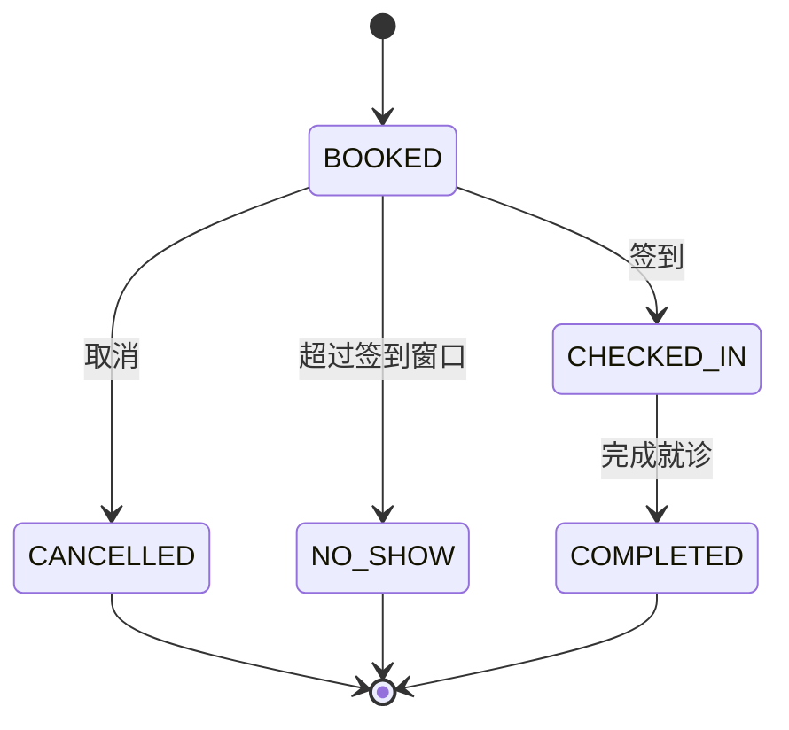
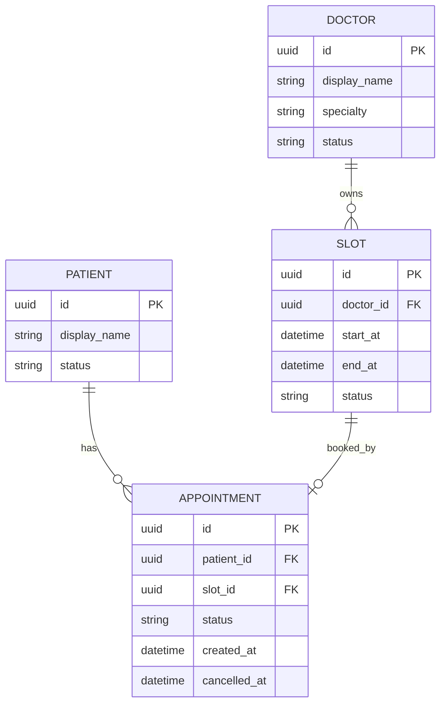

# 14 综合实战：从 0 设计一个医疗预约 SaaS 的完整 Spec

> 本章把前面所有知识串在一个项目里。建议不要只阅读：请在自己的分支中实际创建对应文档。

---

# Part A：项目定义

## 1. Product Vision

诊所希望提供在线预约能力，减少电话预约和前台重复录入，同时让患者能够查看医生可预约时段、创建和取消预约。

第一版不做：
- 在线支付
- 在线问诊
- 电子病历
- 处方
- 保险结算

这一步叫 **Scope Control**。

---

## 2. Stakeholders

| 角色 | 目标 | 主要风险/关注 |
|---|---|---|
| 患者 | 快速预约 | 简单、隐私 |
| 医生 | 排班准确 | 避免冲突 |
| 前台 | 代预约 | 操作效率 |
| 管理员 | 配置系统 | 权限 |
| IT | 稳定运维 | 日志、监控 |
| 安全 | 控制访问 | 隐私、审计 |

---

## 3. Glossary

| 术语 | 定义 |
|---|---|
| Schedule | 医生在某天可工作的时间范围 |
| Slot | 可被预约的离散时间段 |
| Appointment | 患者与特定医生/Slot 建立的预约 |
| Booking Window | 允许提前预约的时间范围 |
| Cancellation Window | 患者允许自行取消的时间范围 |

术语必须统一。不要在不同页面混用“号源”“排班项”“时间格”而不定义差异。

---

# Part B：业务规则

## BR-001
同一个 Slot 在任意时刻最多只能关联一个有效 Appointment。

## BR-002
患者只能为自己创建预约。

> 后续如果增加监护人代预约，应作为新规则和变更处理。

## BR-003
只有状态为 AVAILABLE 的 Slot 可以创建预约。

## BR-004
患者只能取消状态为 BOOKED 的预约。

## BR-005
距离预约开始时间不足 2 小时时，患者不能自行取消。

## BR-006
取消成功后 Slot 重新变为 AVAILABLE。

## BR-007
管理员可因运营原因取消未来预约。

## BR-008
所有预约创建、取消、管理员修改必须写入审计记录。

注意：这里的规则是假设的教学规则。真实医疗系统必须结合实际业务和所在地区法规重新确认。

---

# Part C：状态模型

## Appointment State



### 状态转换表

| From | Event | To | Actor | 条件 |
|---|---|---|---|---|
| BOOKED | cancel | CANCELLED | Patient | ≥2h |
| BOOKED | cancel | CANCELLED | Admin | 有权限 |
| BOOKED | check-in | CHECKED_IN | Frontdesk | 到达允许窗口 |
| BOOKED | timeout | NO_SHOW | System | 超时 |
| CHECKED_IN | complete | COMPLETED | Staff | 就诊完成 |

任何没有出现在表中的转换默认为禁止。

---

# Part D：功能需求

## 模块 1：认证

### AUTH-001
系统必须允许有效用户通过已配置的认证方式登录。

### AUTH-002
未认证用户不得访问需要登录的 Appointment API。

### AUTH-003
当身份凭据无效时，系统必须返回认证失败，而不得泄漏用户是否存在等不必要信息。

---

## 模块 2：查询医生

### DOC-001
患者必须能够查询当前允许在线预约的医生列表。

### DOC-002
列表结果必须至少包含医生 ID、展示名称、专业和可预约状态。

### DOC-003
被停用医生不得出现在默认可预约列表。

---

## 模块 3：查询 Slot

### SLOT-001
患者必须能够按医生和日期查询可预约 Slot。

### SLOT-002
查询结果不得返回已经被有效预约占用的 Slot 作为 AVAILABLE。

### SLOT-003
过去时间的 Slot 不得作为可预约项返回。

---

## 模块 4：创建 Appointment

### APPT-CREATE-001
当患者提交有效 patientId、doctorId、slotId，且 Slot 为 AVAILABLE 时，系统必须创建 Appointment。

### APPT-CREATE-002
创建成功后 Appointment 初始状态必须为 BOOKED。

### APPT-CREATE-003
创建成功后对应 Slot 不得再被其他 Appointment 有效占用。

### APPT-CREATE-004
如果 Slot 已被占用，系统必须拒绝请求并返回 Conflict。

### APPT-CREATE-005
并发请求同一个 Slot 时最多只能有一个请求成功。

### APPT-CREATE-006
患者不得使用自己的身份为其他 patientId 创建预约。

### APPT-CREATE-007
成功创建后必须产生审计事件。

---

## 模块 5：取消 Appointment

### APPT-CAN-001
患者只能取消属于自己的 Appointment。

### APPT-CAN-002
只有 BOOKED 状态允许患者取消。

### APPT-CAN-003
只有距离 Appointment 开始时间不少于 2 小时才允许患者取消。

### APPT-CAN-004
取消成功后状态必须更新为 CANCELLED。

### APPT-CAN-005
取消成功后对应 Slot 必须重新可预约。

### APPT-CAN-006
重复取消已经 CANCELLED 的预约不得再次修改数据。

### APPT-CAN-007
取消必须写入审计事件。

---

# Part E：权限矩阵

| 对象/行为 | 患者 | 医生 | 前台 | 管理员 |
|---|---|---|---|---|
| 查询公开医生 | 是 | 是 | 是 | 是 |
| 查询可用 Slot | 是 | 是 | 是 | 是 |
| 创建自己预约 | 是 | - | 可代办* | 是 |
| 查看自己的预约 | 是 | - | - | 是 |
| 查看指定患者预约 | 否 | 条件* | 是* | 是 |
| 患者规则取消 | 是 | - | 是* | 是 |
| 管理排班 | 否 | 自己* | 条件* | 是 |

带 * 的内容必须继续定义详细条件，不能以此表直接作为最终实现规则。

---

# Part F：API Specification

## 1. 查询医生

```
GET /api/v1/doctors?specialty=cardiology&page=1&pageSize=20
```

成功：
`200 OK`

```json
{
  "items": [
    {
      "id": "D001",
      "displayName": "示例医生",
      "specialty": "Cardiology"
    }
  ],
  "page": 1,
  "pageSize": 20,
  "total": 1
}
```

---

## 2. 查询 Slot

```
GET /api/v1/doctors/{doctorId}/slots?date=2026-10-01
```

失败：
- 400 日期格式不合法
- 404 doctorId 不存在

---

## 3. 创建 Appointment

```
POST /api/v1/appointments
Authorization: Bearer <token>
Content-Type: application/json
```

Request：

```json
{
  "patientId": "P001",
  "slotId": "S001"
}
```

成功：

```
201 Created
```

```json
{
  "id": "A001",
  "patientId": "P001",
  "slotId": "S001",
  "status": "BOOKED"
}
```

错误：

| HTTP | Code | 条件 |
|---|---|---|
| 400 | INVALID_REQUEST | JSON/字段不合法 |
| 401 | UNAUTHENTICATED | 未登录 |
| 403 | PATIENT_ACCESS_DENIED | 越权 patientId |
| 404 | SLOT_NOT_FOUND | Slot 不存在 |
| 409 | SLOT_ALREADY_BOOKED | Slot 已被占用 |

---

## 4. 取消

```
POST /api/v1/appointments/{appointmentId}/cancel
```

错误：

| HTTP | Code |
|---|---|
| 403 | APPOINTMENT_ACCESS_DENIED |
| 404 | APPOINTMENT_NOT_FOUND |
| 409 | INVALID_APPOINTMENT_STATE |
| 409 | CANCELLATION_WINDOW_CLOSED |

---

# Part G：数据模型



### 关键不变量

仅在应用层“先查再写”不能完全解决并发。

业务要求必须表达：
> 一个 Slot 不允许存在多个有效 Appointment。

具体如何通过唯一约束、锁、事务等实现，由架构/开发决定，但必须证明此不变量被保证。

---

# Part H：非功能需求

## PERF-001
在约定测试环境与正常业务负载下，预约查询 API 的 P95 响应时间应不高于 500 ms。

待补充：
- 正常负载并发量
- 数据规模
- 测量位置

注意：没有补齐这些测量条件之前，该 Requirement 仍不完整。

## REL-001
创建 Appointment 的数据库事务不得产生“Appointment 已创建但 Slot 仍可被另一个请求成功预约”的不一致状态。

## SEC-001
所有需要患者身份的 API 必须在服务端执行对象级授权，不得仅依赖客户端隐藏按钮。

## SEC-002
系统不得在日志中记录认证凭证或完整访问 Token。

## AUD-001
Appointment 创建和取消审计事件至少保存：
- actor
- action
- object id
- timestamp
- result

---

# Part I：Acceptance Criteria

Story：

> 作为患者，我希望取消尚未开始且满足规则的预约，以便释放不再需要的号源。

### AC-01 正常取消
Given 患者已认证  
And Appointment 属于该患者  
And status=BOOKED  
And 当前时间距离预约开始恰好 2 小时  
When 调用 cancel  
Then 返回成功  
And status=CANCELLED  
And Slot=AVAILABLE  
And 写审计事件

### AC-02 少于 2 小时
Given 其他条件相同  
And 距离开始 1:59:59  
When cancel  
Then 返回 CANCELLATION_WINDOW_CLOSED  
And Appointment 不变化  
And Slot 不变化

### AC-03 越权
Given Appointment 属于 Patient B  
When Patient A cancel  
Then 返回 403  
And 不泄漏多余患者信息

### AC-04 重复请求
Given Appointment 已 CANCELLED  
When 再次 cancel  
Then 不允许产生第二次状态变化

---

# Part J：测试设计

## 等价类
Cancellation Window：
- >2h
- =2h
- <2h

## 状态转换
- BOOKED → CANCELLED：允许
- CHECKED_IN → CANCELLED：拒绝
- COMPLETED → CANCELLED：拒绝
- NO_SHOW → CANCELLED：拒绝
- CANCELLED → CANCELLED：拒绝/幂等策略由 Spec 定义

## 权限
- owner patient
- other patient
- unauthenticated
- admin
- frontdesk

## 并发
两个用户同时请求 S001：
- 只能一个 201
- 另一个必须 409
- DB 最终只有一个有效 appointment

---

# Part K：追踪矩阵

| Requirement | API/Data | Acceptance/Test |
|---|---|---|
| APPT-CREATE-001 | POST /appointments | TC-CREATE-01 |
| APPT-CREATE-004 | 409 SLOT_ALREADY_BOOKED | TC-CREATE-04 |
| APPT-CREATE-005 | DB/transaction | TC-CONC-01 |
| APPT-CAN-003 | POST /{id}/cancel | AC-01, AC-02 |
| SEC-001 | authorization middleware | TC-AUTH-01~03 |
| AUD-001 | audit event | TC-AUD-01 |

---

# Part L：Open Questions

真实项目中一定保留未确认项：

- 是否允许患者改期？
- 管理员取消是否受 2 小时限制？
- 医生是否可以取消？
- 取消是否必须填写原因？
- 通知失败是否影响取消成功？
- 是否允许重复预约相同医生同一天？
- Slot 的时间长度谁配置？
- 跨时区如何处理？
- 审计日志保存多久？
- Patient 数据保留多久？

**Unknown 不等于可以让开发猜。**

---

# Part M：Change Request 演练

新需求：

> “患者现在可以在预约前 30 分钟取消。”

不要只改一个数字。

影响分析：
- BR-005
- APPT-CAN-003
- API business error
- UI 提示
- FAQ
- AC-01/02
- Boundary Tests
- Existing automated tests
- Potential operational impact

这就是 Spec Engineer 必须培养的系统性思维。

---

# Part N：最终交付包

完成本实战后，请在你的项目中拥有：

```
00-vision-scope.md
01-stakeholders.md
02-glossary.md
03-business-rules.md
04-functional-requirements.md
05-state-models.md
06-permissions.md
07-api-spec.md
08-data-spec.md
09-nfr.md
10-user-stories-ac.md
11-test-spec.md
12-traceability.csv
13-open-questions.md
14-decision-log.md
15-change-log.md
```

当另一位开发人员或 AI Coding Agent 只读取这些内容，就能够理解“系统应该表现成什么样”，你才真正完成了 Spec 工作。

---

## 实战验收

你必须能回答：
1. 每条功能由哪个业务目标产生？
2. 每条 Requirement 如何测试？
3. 每个 API 错误如何触发？
4. 每个对象有哪些状态？
5. 谁可以对谁的数据做什么？
6. 并发时业务不变量是什么？
7. 需求变更影响哪些工件？
8. 哪些内容仍是 Open Question？

---

## 延伸权威资料

- IREB CPRE Foundation  
  https://cpre.ireb.org/en/concept/foundationlevel

- IREB CPRE Glossary  
  https://cpre.ireb.org/en/downloads-and-resources/glossary

- Microsoft REST API 设计  
  https://learn.microsoft.com/zh-cn/azure/architecture/best-practices/api-design

- Microsoft 架构设计规范  
  https://learn.microsoft.com/en-us/azure/well-architected/architect-role/architecture-design-specification

- Microsoft 关系数据基础  
  https://learn.microsoft.com/en-us/training/modules/describe-concepts-of-relational-data/

- OWASP API Security  
  https://owasp.org/projects/api-security-project

- ISTQB CTFL v4.0  
  https://www.istqb.org/certifications/certified-tester-foundation-level-ctfl-v4-0/
